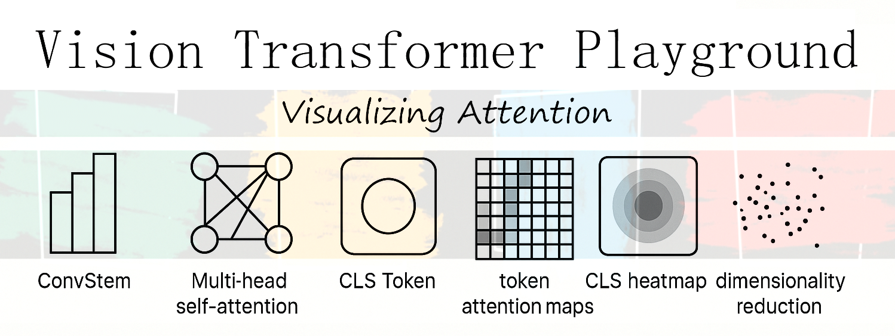
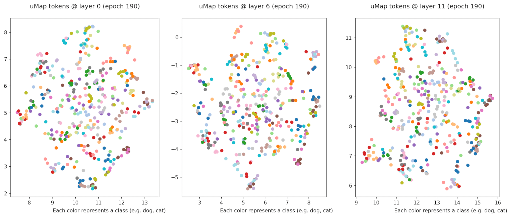

---
## [](#)
---

## Vision Transformer (ViT) Playground

> **A complete ViT implementation, from scratch, with advanced visualizations and flexible training**

---

### 🚀 Project Overview

This project is a custom implementation of the Vision Transformer (ViT) architecture with several visualizations for analyzing activations throughout the architecture, built and trained on CIFAR-100.  
**Major features:**

- Custom ConvStem, Patch Embeddings, MSA, Transformer block, and CLS patch.
- High flexibility via configuration files for quick experiments.
- Rich visualizations to understand model internals, from token attention to activation hooks.
- Support for both **Weights & Biases** and **TensorBoard** logging.
- Mixed-precision training (AMP) for efficiency.
- Resume and checkpoint options for robust training workflows.
- Dataset 'Mixup' and 'Cutmix' preprocessing
- Scheduler warmup phase

### 🧩 Model Architecture

- **Input:** 32×32 images from CIFAR-100
- **Major components:**
  - ConvStem for initial processing
  - Patch Embedding Layer
  - Multi-Head Self Attention (8 heads)
  - 12 Transformer Blocks (Depth: 12)
  - 768 embedding dimensions
  - CLS Token for whole-image classification
- **Loss:** CrossEntropyLoss
- **Optimizer:** AdamW (with weight decay)
- **Scheduler:** CosineAnnealingLR with Warmup
- **Early Stopping:** If no improvement over 20 epochs

---

### 🔍 Model Visualizations

**Custom Analysis and Debugging Tools:**  
_Get a peek inside the ViT! All visualizations are automatically generated and can be toggled via config._

| Visualization Type               | Description                                                                      |
| -------------------------------- | -------------------------------------------------------------------------------- |
| **CLS <-> Token Attention**      | CLS-centric attention map as a line plot                                         |
| **CLS Heatmap**                  | Heatmap of the CLS token embeddings for interpretability                         |
| **CLS Dimensionality Reduction** | UMap 2D projections of CLS embeddings per class                                  |
| **Self Attention Heads Heatmap** | All attention heads heatmap in a single grid                                     |
| **Attention Hooks**              | Inspect patch projections, pre/post-norm, attention out from blocks 1, 6, and 11 |

---

### 📚 Sample Visualizations

#### CLS Dimensionality Reduction



#### Self Attention Heads Heatmap


#### CLS <-> Token Attention


---

### ⚙️ Training Configuration

_All training aspects are controlled by a Python dataclass config file:_

```python
@dataclass
class TrainViTConfig:
    # Data & training
    data_dir: str = "./data"
    batch_size: int = 128
    epochs: int = 200
    img_size: int = 32
    val_split: float = 0.2

    # Optimizer & scheduler
    lr: float = 3e-4
    weight_decay: float = 0.05
    eta_min: float = 1e-4
    early_stopping: int = 20

    # Model architecture
    use_amp: bool = True
    patch_size: int = 4
    embed_dim: int = 768
    depth: int = 12
    mlp_ratio: float = 4.0
    num_heads: int = 8
    drop_rate: float = 0.1
    attn_drop_rate: float = 0.0

    # Logging & visualization
    project_name: str = "vit-cifar100"
    vit_visualizers: List[str] = field(default_factory=lambda: ["token_attn_maps", "cls_heatmap", "cls_dim_reduction", "hooks"])
    visualize_every_n_epochs: int = 10
    visualize_layers: List[int] = field(default_factory=lambda:[0, 6, 11])
    save_npy: bool = False
    log_backend: str = "both"  # Options: 'wandb', 'tensorboard', 'both', ''

    # Checkpointing
    checkpoint_out_dir: str = ""
    save_every_n_epochs: int = 40
    resume_from_checkpoint: bool = False
    resume_checkpoint_path: str = ""
```

---

### 🛠️ Extra Features & Engineering

- **AMP (Automatic Mixed Precision):** Faster training, less GPU memory.
- **Config-driven:** Reproducibility and quick tweaks.
- **Logging:** TensorBoard, Weights & Biases, or both.
- **Checkpointing:** Save/reload at any epoch.
- **Customizable Visualizations:** Toggle each visualizer and analysis by config.
- **Multi-device Support:** Easily run on GPU/CPU.

---

### 🚦 How to Run

1. **Clone the repo**
2. **Install requirements**:
   ```bash
   pip install -r requirements.txt
   ```
3. **Configure your training in `config.py`**
4. **Start training**:
   ```bash
   python main.py
   ```

---

### 💡 Future Work

- Improve CLS dimensionality reduction visualizations for easier clustering.
- Experiment with longer or more diverse training (larger epochs, data aug).
- Integrate with other datasets (e.g. ImageNet, Tiny_ImageNet).
- Add more interpretability tools.

---

### 📎 Appendix

#### 📚 Relevant Papers & Acknowledgements

- **Vision Transformer (ViT):**
  - _Dosovitskiy et al., “An Image is Worth 16x16 Words: Transformers for Image Recognition at Scale”_ [[arXiv:2010.11929](https://arxiv.org/abs/2010.11929)]
- **CLS Token:**
  - _Inspired by [BERT](https://arxiv.org/abs/1810.04805) (Devlin et al. 2018) and Vision Transformer designs. The use of a special CLS token enables the model to aggregate global information for classification tasks._

#### 🙏 Acknowledgements

- Inspired and informed by the original **ViT paper** (Dosovitskiy et al.), as well as foundational works on Transformers and training optimization.
- Thanks to open-source libraries (PyTorch, Weights & Biases, TensorBoard) which made rapid experimentation possible.
- Special thanks to the community’s work on explainable AI and interpretability.

---

### 👋 About Me

Created entirely from scratch—architecture, training loop, visualization, and config—by Gabriel Souza.  
I’m passionate about deep learning and always eager to learn more about model interpretability and architecture design.  
**Feel free to reach out or connect!**

---
